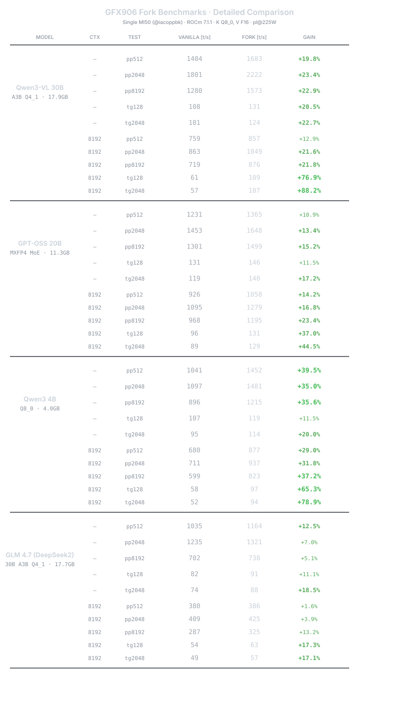
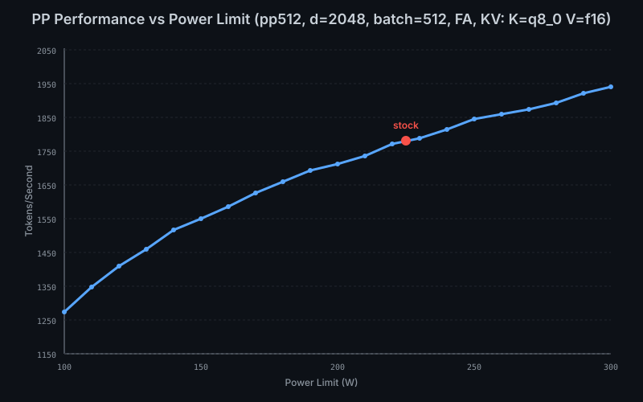
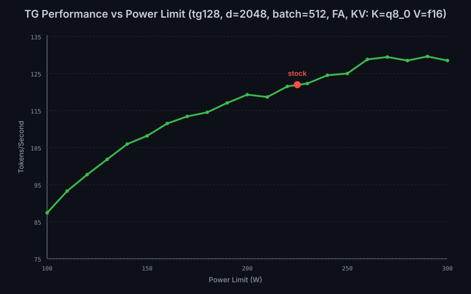

# TESTING NEEDED: this version has some bugs that seems to be affecting output correctness. Its an experimental build, use at your risk until will be fixed! 


# llama.cpp-gfx906-2602

Based on llama.cpp build 7924.


## Benchmark Results



See [SCRIPT_llama_bench.sh](SCRIPT_llama_bench.sh) for llama-bench configuration and [SCRIPT_launch_server_MI50.sh](SCRIPT_launch_server_MI50.sh) for server launch settings.


## What Changed

The core modifications are implemented in ggml-cuda/gfx906 folder.
### 2602
```
  ggml/src/ggml-cuda/gfx906/
  ├── gfx906-common.cuh          - DPP warp reductions & common utilities
  ├── gfx906-config.h            - Feature toggles
  ├── attention/
  │   ├── fattn-q8.cuh           - Q8 FlashAttention kernel
  │   ├── fattn-q8.cu            - Instance launcher
  │   ├── rope.cuh               - Optimized RoPE kernel
  │   └── instances/             - Template instantiations for various head dims
  ├── fused/
  │   ├── gather-q8.cuh          - Q8 gather helpers
  │   ├── gather-q8.cu           - Q8 gather kernel
  │   ├── graph-fusion.cuh       - Graph fusion logic
  │   ├── mmq-prequantized.cuh   - Prequantized MMQ helpers
  │   ├── norm-fused-q8.cuh      - Fused norm dispatch
  │   └── norm-fused-q8.cu       - Fused norm kernels
  ├── matmul/
  │   ├── mmf.cuh                - MMF (mul-mat-fused) helpers
  │   ├── mmq.cuh                - MMQ vectorized loads
  │   ├── mmq-prefetch.cuh       - Prefetch helpers
  │   ├── mmvq-q4_0.cuh          - Warp-cooperative MMVQ Q4_0
  │   ├── mmvq-q4_1.cuh          - Warp-cooperative MMVQ Q4_1
  │   ├── mmvq-q8_0.cuh          - Warp-cooperative MMVQ Q8_0
  │   └── sgemm.cuh              - SGEMM helpers
  └── quantize/
      ├── epilogue.cuh           - DPP-based Q8_1 epilogue
      ├── q8-cache.cuh           - Q8 cross-op cache
      └── vecdotq.cuh            - MXFP4 vectorized loads
```


The main goal of `llama.cpp` is to enable LLM inference with minimal setup and state-of-the-art performance on a wide
range of hardware - locally and in the cloud.

- Plain C/C++ implementation without any dependencies
- Apple silicon is a first-class citizen - optimized via ARM NEON, Accelerate and Metal frameworks
- AVX, AVX2, AVX512 and AMX support for x86 architectures
- RVV, ZVFH, ZFH, ZICBOP and ZIHINTPAUSE support for RISC-V architectures
- 1.5-bit, 2-bit, 3-bit, 4-bit, 5-bit, 6-bit, and 8-bit integer quantization for faster inference and reduced memory use
- Custom CUDA kernels for running LLMs on NVIDIA GPUs (support for AMD GPUs via HIP and Moore Threads GPUs via MUSA)
- Vulkan and SYCL backend support
- CPU+GPU hybrid inference to partially accelerate models larger than the total VRAM capacity

The `llama.cpp` project is the main playground for developing new features for the [ggml](https://github.com/ggml-org/ggml) library.

<details>
<summary>Models</summary>

Typically finetunes of the base models below are supported as well.

Instructions for adding support for new models: [HOWTO-add-model.md](docs/development/HOWTO-add-model.md)

#### Text-only

- [X] LLaMA 🦙
- [x] LLaMA 2 🦙🦙
- [x] LLaMA 3 🦙🦙🦙
- [X] [Mistral 7B](https://huggingface.co/mistralai/Mistral-7B-v0.1)
- [x] [Mixtral MoE](https://huggingface.co/models?search=mistral-ai/Mixtral)
- [x] [DBRX](https://huggingface.co/databricks/dbrx-instruct)
- [x] [Jamba](https://huggingface.co/ai21labs)
- [X] [Falcon](https://huggingface.co/models?search=tiiuae/falcon)
- [X] [Chinese LLaMA / Alpaca](https://github.com/ymcui/Chinese-LLaMA-Alpaca) and [Chinese LLaMA-2 / Alpaca-2](https://github.com/ymcui/Chinese-LLaMA-Alpaca-2)
- [X] [Vigogne (French)](https://github.com/bofenghuang/vigogne)
- [X] [BERT](https://github.com/ggml-org/llama.cpp/pull/5423)
- [X] [Koala](https://bair.berkeley.edu/blog/2023/04/03/koala/)
- [X] [Baichuan 1 & 2](https://huggingface.co/models?search=baichuan-inc/Baichuan) + [derivations](https://huggingface.co/hiyouga/baichuan-7b-sft)
- [X] [Aquila 1 & 2](https://huggingface.co/models?search=BAAI/Aquila)
- [X] [Starcoder models](https://github.com/ggml-org/llama.cpp/pull/3187)
- [X] [Refact](https://huggingface.co/smallcloudai/Refact-1_6B-fim)
- [X] [MPT](https://github.com/ggml-org/llama.cpp/pull/3417)
- [X] [Bloom](https://github.com/ggml-org/llama.cpp/pull/3553)
- [x] [Yi models](https://huggingface.co/models?search=01-ai/Yi)
- [X] [StableLM models](https://huggingface.co/stabilityai)
- [x] [Deepseek models](https://huggingface.co/models?search=deepseek-ai/deepseek)
- [x] [Qwen models](https://huggingface.co/models?search=Qwen/Qwen)
- [x] [PLaMo-13B](https://github.com/ggml-org/llama.cpp/pull/3557)
- [x] [Phi models](https://huggingface.co/models?search=microsoft/phi)
- [x] [PhiMoE](https://github.com/ggml-org/llama.cpp/pull/11003)
- [x] [GPT-2](https://huggingface.co/gpt2)
- [x] [Orion 14B](https://github.com/ggml-org/llama.cpp/pull/5118)
- [x] [InternLM2](https://huggingface.co/models?search=internlm2)
- [x] [CodeShell](https://github.com/WisdomShell/codeshell)
- [x] [Gemma](https://ai.google.dev/gemma)
- [x] [Mamba](https://github.com/state-spaces/mamba)
- [x] [Grok-1](https://huggingface.co/keyfan/grok-1-hf)
- [x] [Xverse](https://huggingface.co/models?search=xverse)
- [x] [Command-R models](https://huggingface.co/models?search=CohereForAI/c4ai-command-r)
- [x] [SEA-LION](https://huggingface.co/models?search=sea-lion)
- [x] [GritLM-7B](https://huggingface.co/GritLM/GritLM-7B) + [GritLM-8x7B](https://huggingface.co/GritLM/GritLM-8x7B)
- [x] [OLMo](https://allenai.org/olmo)
- [x] [OLMo 2](https://allenai.org/olmo)
- [x] [OLMoE](https://huggingface.co/allenai/OLMoE-1B-7B-0924)
- [x] [Granite models](https://huggingface.co/collections/ibm-granite/granite-code-models-6624c5cec322e4c148c8b330)
- [x] [GPT-NeoX](https://github.com/EleutherAI/gpt-neox) + [Pythia](https://github.com/EleutherAI/pythia)
- [x] [Snowflake-Arctic MoE](https://huggingface.co/collections/Snowflake/arctic-66290090abe542894a5ac520)
- [x] [Smaug](https://huggingface.co/models?search=Smaug)
- [x] [Poro 34B](https://huggingface.co/LumiOpen/Poro-34B)
- [x] [Bitnet b1.58 models](https://huggingface.co/1bitLLM)
- [x] [Flan T5](https://huggingface.co/models?search=flan-t5)
- [x] [Open Elm models](https://huggingface.co/collections/apple/openelm-instruct-models-6619ad295d7ae9f868b759ca)
- [x] [ChatGLM3-6b](https://huggingface.co/THUDM/chatglm3-6b) + [ChatGLM4-9b](https://huggingface.co/THUDM/glm-4-9b) + [GLMEdge-1.5b](https://huggingface.co/THUDM/glm-edge-1.5b-chat) + [GLMEdge-4b](https://huggingface.co/THUDM/glm-edge-4b-chat)
- [x] [GLM-4-0414](https://huggingface.co/collections/THUDM/glm-4-0414-67f3cbcb34dd9d252707cb2e)
- [x] [SmolLM](https://huggingface.co/collections/HuggingFaceTB/smollm-6695016cad7167254ce15966)
- [x] [EXAONE-3.0-7.8B-Instruct](https://huggingface.co/LGAI-EXAONE/EXAONE-3.0-7.8B-Instruct)
- [x] [FalconMamba Models](https://huggingface.co/collections/tiiuae/falconmamba-7b-66b9a580324dd1598b0f6d4a)
- [x] [Jais](https://huggingface.co/inceptionai/jais-13b-chat)
- [x] [Bielik-11B-v2.3](https://huggingface.co/collections/speakleash/bielik-11b-v23-66ee813238d9b526a072408a)
- [x] [RWKV-7](https://huggingface.co/collections/shoumenchougou/rwkv7-gxx-gguf)
- [x] [RWKV-6](https://github.com/BlinkDL/RWKV-LM)
- [x] [QRWKV-6](https://huggingface.co/recursal/QRWKV6-32B-Instruct-Preview-v0.1)
- [x] [GigaChat-20B-A3B](https://huggingface.co/ai-sage/GigaChat-20B-A3B-instruct)
- [X] [Trillion-7B-preview](https://huggingface.co/trillionlabs/Trillion-7B-preview)
- [x] [Ling models](https://huggingface.co/collections/inclusionAI/ling-67c51c85b34a7ea0aba94c32)
- [x] [LFM2 models](https://huggingface.co/collections/LiquidAI/lfm2-686d721927015b2ad73eaa38)
- [x] [Hunyuan models](https://huggingface.co/collections/tencent/hunyuan-dense-model-6890632cda26b19119c9c5e7)
- [x] [BailingMoeV2 (Ring/Ling 2.0) models](https://huggingface.co/collections/inclusionAI/ling-v2-68bf1dd2fc34c306c1fa6f86)

#### Multimodal

- [x] [LLaVA 1.5 models](https://huggingface.co/collections/liuhaotian/llava-15-653aac15d994e992e2677a7e), [LLaVA 1.6 models](https://huggingface.co/collections/liuhaotian/llava-16-65b9e40155f60fd046a5ccf2)
- [x] [BakLLaVA](https://huggingface.co/models?search=SkunkworksAI/Bakllava)
- [x] [Obsidian](https://huggingface.co/NousResearch/Obsidian-3B-V0.5)
- [x] [ShareGPT4V](https://huggingface.co/models?search=Lin-Chen/ShareGPT4V)
- [x] [MobileVLM 1.7B/3B models](https://huggingface.co/models?search=mobileVLM)
- [x] [Yi-VL](https://huggingface.co/models?search=Yi-VL)
- [x] [Mini CPM](https://huggingface.co/models?search=MiniCPM)
- [x] [Moondream](https://huggingface.co/vikhyatk/moondream2)
- [x] [Bunny](https://github.com/BAAI-DCAI/Bunny)
- [x] [GLM-EDGE](https://huggingface.co/models?search=glm-edge)
- [x] [Qwen2-VL](https://huggingface.co/collections/Qwen/qwen2-vl-66cee7455501d7126940800d)
- [x] [LFM2-VL](https://huggingface.co/collections/LiquidAI/lfm2-vl-68963bbc84a610f7638d5ffa)

</details>

<details>
<summary>Bindings</summary>

- Python: [ddh0/easy-llama](https://github.com/ddh0/easy-llama)
- Python: [abetlen/llama-cpp-python](https://github.com/abetlen/llama-cpp-python)
- Go: [go-skynet/go-llama.cpp](https://github.com/go-skynet/go-llama.cpp)
- Node.js: [withcatai/node-llama-cpp](https://github.com/withcatai/node-llama-cpp)
- JS/TS (llama.cpp server client): [lgrammel/modelfusion](https://modelfusion.dev/integration/model-provider/llamacpp)
- JS/TS (Programmable Prompt Engine CLI): [offline-ai/cli](https://github.com/offline-ai/cli)
- JavaScript/Wasm (works in browser): [tangledgroup/llama-cpp-wasm](https://github.com/tangledgroup/llama-cpp-wasm)
- Typescript/Wasm (nicer API, available on npm): [ngxson/wllama](https://github.com/ngxson/wllama)
- Ruby: [yoshoku/llama_cpp.rb](https://github.com/yoshoku/llama_cpp.rb)
- Rust (more features): [edgenai/llama_cpp-rs](https://github.com/edgenai/llama_cpp-rs)
- Rust (nicer API): [mdrokz/rust-llama.cpp](https://github.com/mdrokz/rust-llama.cpp)
- Rust (more direct bindings): [utilityai/llama-cpp-rs](https://github.com/utilityai/llama-cpp-rs)
- Rust (automated build from crates.io): [ShelbyJenkins/llm_client](https://github.com/ShelbyJenkins/llm_client)
- C#/.NET: [SciSharp/LLamaSharp](https://github.com/SciSharp/LLamaSharp)
- C#/VB.NET (more features - community license): [LM-Kit.NET](https://docs.lm-kit.com/lm-kit-net/index.html)
- Scala 3: [donderom/llm4s](https://github.com/donderom/llm4s)
- Clojure: [phronmophobic/llama.clj](https://github.com/phronmophobic/llama.clj)
- React Native: [mybigday/llama.rn](https://github.com/mybigday/llama.rn)
- Java: [kherud/java-llama.cpp](https://github.com/kherud/java-llama.cpp)
- Java: [QuasarByte/llama-cpp-jna](https://github.com/QuasarByte/llama-cpp-jna)
- Zig: [deins/llama.cpp.zig](https://github.com/Deins/llama.cpp.zig)
- Flutter/Dart: [netdur/llama_cpp_dart](https://github.com/netdur/llama_cpp_dart)
- Flutter: [xuegao-tzx/Fllama](https://github.com/xuegao-tzx/Fllama)
- PHP (API bindings and features built on top of llama.cpp): [distantmagic/resonance](https://github.com/distantmagic/resonance) [(more info)](https://github.com/ggml-org/llama.cpp/pull/6326)
- Guile Scheme: [guile_llama_cpp](https://savannah.nongnu.org/projects/guile-llama-cpp)
- Swift [srgtuszy/llama-cpp-swift](https://github.com/srgtuszy/llama-cpp-swift)
- Swift [ShenghaiWang/SwiftLlama](https://github.com/ShenghaiWang/SwiftLlama)
- Delphi [Embarcadero/llama-cpp-delphi](https://github.com/Embarcadero/llama-cpp-delphi)
- Go (no CGo needed): [hybridgroup/yzma](https://github.com/hybridgroup/yzma)
- Android: [llama.android](/examples/llama.android)

</details>

<details>
<summary>UIs</summary>

*(to have a project listed here, it should clearly state that it depends on `llama.cpp`)*

- [AI Sublime Text plugin](https://github.com/yaroslavyaroslav/OpenAI-sublime-text) (MIT)
- [BonzAI App](https://apps.apple.com/us/app/bonzai-your-local-ai-agent/id6752847988) (proprietary)
- [cztomsik/ava](https://github.com/cztomsik/ava) (MIT)
- [Dot](https://github.com/alexpinel/Dot) (GPL)
- [eva](https://github.com/ylsdamxssjxxdd/eva) (MIT)
- [iohub/collama](https://github.com/iohub/coLLaMA) (Apache-2.0)
- [janhq/jan](https://github.com/janhq/jan) (AGPL)
- [johnbean393/Sidekick](https://github.com/johnbean393/Sidekick) (MIT)
- [KanTV](https://github.com/zhouwg/kantv?tab=readme-ov-file) (Apache-2.0)
- [KodiBot](https://github.com/firatkiral/kodibot) (GPL)
- [llama.vim](https://github.com/ggml-org/llama.vim) (MIT)
- [LARS](https://github.com/abgulati/LARS) (AGPL)
- [Llama Assistant](https://github.com/vietanhdev/llama-assistant) (GPL)
- [LlamaLib](https://github.com/undreamai/LlamaLib) (Apache-2.0)
- [LLMFarm](https://github.com/guinmoon/LLMFarm?tab=readme-ov-file) (MIT)
- [LLMUnity](https://github.com/undreamai/LLMUnity) (MIT)
- [LMStudio](https://lmstudio.ai/) (proprietary)
- [LocalAI](https://github.com/mudler/LocalAI) (MIT)
- [LostRuins/koboldcpp](https://github.com/LostRuins/koboldcpp) (AGPL)
- [MindMac](https://mindmac.app) (proprietary)
- [MindWorkAI/AI-Studio](https://github.com/MindWorkAI/AI-Studio) (FSL-1.1-MIT)
- [Mobile-Artificial-Intelligence/maid](https://github.com/Mobile-Artificial-Intelligence/maid) (MIT)
- [Mozilla-Ocho/llamafile](https://github.com/Mozilla-Ocho/llamafile) (Apache-2.0)
- [nat/openplayground](https://github.com/nat/openplayground) (MIT)
- [nomic-ai/gpt4all](https://github.com/nomic-ai/gpt4all) (MIT)
- [ollama/ollama](https://github.com/ollama/ollama) (MIT)
- [oobabooga/text-generation-webui](https://github.com/oobabooga/text-generation-webui) (AGPL)
- [PocketPal AI](https://github.com/a-ghorbani/pocketpal-ai) (MIT)
- [psugihara/FreeChat](https://github.com/psugihara/FreeChat) (MIT)
- [ptsochantaris/emeltal](https://github.com/ptsochantaris/emeltal) (MIT)
- [pythops/tenere](https://github.com/pythops/tenere) (AGPL)
- [ramalama](https://github.com/containers/ramalama) (MIT)
- [semperai/amica](https://github.com/semperai/amica) (MIT)
- [withcatai/catai](https://github.com/withcatai/catai) (MIT)
- [Autopen](https://github.com/blackhole89/autopen) (GPL)

</details>

<details>
<summary>Tools</summary>

- [akx/ggify](https://github.com/akx/ggify) – download PyTorch models from HuggingFace Hub and convert them to GGML
- [akx/ollama-dl](https://github.com/akx/ollama-dl) – download models from the Ollama library to be used directly with llama.cpp
- [crashr/gppm](https://github.com/crashr/gppm) – launch llama.cpp instances utilizing NVIDIA Tesla P40 or P100 GPUs with reduced idle power consumption
- [gpustack/gguf-parser](https://github.com/gpustack/gguf-parser-go/tree/main/cmd/gguf-parser) - review/check the GGUF file and estimate the memory usage
- [Styled Lines](https://marketplace.unity.com/packages/tools/generative-ai/styled-lines-llama-cpp-model-292902) (proprietary licensed, async wrapper of inference part for game development in Unity3d with pre-built Mobile and Web platform wrappers and a model example)
- [unslothai/unsloth](https://github.com/unslothai/unsloth) – 🦥 exports/saves fine-tuned and trained models to GGUF (Apache-2.0)

</details>

<details>
<summary>Infrastructure</summary>

- [Paddler](https://github.com/intentee/paddler) - Open-source LLMOps platform for hosting and scaling AI in your own infrastructure
- [GPUStack](https://github.com/gpustack/gpustack) - Manage GPU clusters for running LLMs
- [llama_cpp_canister](https://github.com/onicai/llama_cpp_canister) - llama.cpp as a smart contract on the Internet Computer, using WebAssembly
- [llama-swap](https://github.com/mostlygeek/llama-swap) - transparent proxy that adds automatic model switching with llama-server
- [Kalavai](https://github.com/kalavai-net/kalavai-client) - Crowdsource end to end LLM deployment at any scale
- [llmaz](https://github.com/InftyAI/llmaz) - ☸️ Easy, advanced inference platform for large language models on Kubernetes.
</details>

<details>
<summary>Games</summary>

- [Lucy's Labyrinth](https://github.com/MorganRO8/Lucys_Labyrinth) - A simple maze game where agents controlled by an AI model will try to trick you.

</details>


## Supported backends

| Backend | Target devices |
| --- | --- |
| [Metal](docs/build.md#metal-build) | Apple Silicon |
| [BLAS](docs/build.md#blas-build) | All |
| [BLIS](docs/backend/BLIS.md) | All |
| [SYCL](docs/backend/SYCL.md) | Intel and Nvidia GPU |
| [MUSA](docs/build.md#musa) | Moore Threads GPU |
| [CUDA](docs/build.md#cuda) | Nvidia GPU |
| [HIP](docs/build.md#hip) | AMD GPU |
| [ZenDNN](docs/build.md#zendnn) | AMD CPU |
| [Vulkan](docs/build.md#vulkan) | GPU |
| [CANN](docs/build.md#cann) | Ascend NPU |
| [OpenCL](docs/backend/OPENCL.md) | Adreno GPU |
| [IBM zDNN](docs/backend/zDNN.md) | IBM Z & LinuxONE |
| [WebGPU [In Progress]](docs/build.md#webgpu) | All |
| [RPC](https://github.com/ggml-org/llama.cpp/tree/master/tools/rpc) | All |
| [Hexagon [In Progress]](docs/backend/hexagon/README.md) | Snapdragon |
| [VirtGPU](docs/backend/VirtGPU.md) | VirtGPU APIR |

## Obtaining and quantizing models

The [Hugging Face](https://huggingface.co) platform hosts a [number of LLMs](https://huggingface.co/models?library=gguf&sort=trending) compatible with `llama.cpp`:

- [Trending](https://huggingface.co/models?library=gguf&sort=trending)
- [LLaMA](https://huggingface.co/models?sort=trending&search=llama+gguf)

You can either manually download the GGUF file or directly use any `llama.cpp`-compatible models from [Hugging Face](https://huggingface.co/) or other model hosting sites, such as [ModelScope](https://modelscope.cn/), by using this CLI argument: `-hf <user>/<model>[:quant]`. For example:

```sh
llama-cli -hf ggml-org/gemma-3-1b-it-GGUF
### 2601
```
gfx906-mmvq-q4_0.cuh Warp-cooperative Q4_0 MMVQ kernel
gfx906-mmvq-q4_1.cuh Warp-cooperative Q4_1 MMVQ kernel
gfx906-mmvq-q8_0.cuh Warp-cooperative Q8_0 MMVQ kernel
mmvq.cu              Half-warp (32 threads) dispatch for MoE small matrices
```

### 2512
```
mmq.cuh              Software pipelining for Q8_0 MMQ loads
mmq.cuh              Optimized Q8 MMQ need_check path to avoid LDS conflicts
mmq.cuh              MXFP4 load pipeline with e8m0 conversion optimization
vecdotq.cuh          Fast Q8_0 load path using memcpy
vecdotq.cuh          Software pipeline MXFP4 MMVQ for v_perm latency hiding
vecdotq.cuh          MXFP4 lookup with 2-perm + arithmetic sign
mmq.cu/mmid.cu       MoE sub-warp shuffle fix for wavefront64 (fixes gpt-oss loading problems)
```

### 2511

```
common.cuh           DPP-based warp reductions with unified shuffle XOR dispatch
fattn-common.cuh     GCN-optimized thread counts and tile configurations
fattn.cu             Q8-optimized tile kernel selection for GFX906 flash attention
mmq.cu               Integrated GFX906 vectorized loads for Q4_0/Q4_1 quantizations
gfx906/              New directory with MI50/MI60-specific kernel implementations
```


## Quick Start

Optional but sometimes required, set your paths for rocm and device libs if they are not in /opt/rocm/

```bash
export ROCM_PATH=/opt/rocm-7.1.0 #optional
export HIP_DEVICE_LIB_PATH=/opt/rocm-7.1.0/amdgcn/bitcode #optional
```

```bash
git clone https://github.com/iacopPBK/llama.cpp-gfx906.git
cd llama.cpp-gfx906
./SCRIPT_compile_MI50.sh      # edit ROCM_PATH if not using /opt/rocm
./SCRIPT_launch_server_MI50.sh # edit MODEL_PATH to your model file
./SCRIPT_llama_bench.sh # edit MODEL_PATH to your model file, performs the bench shown above

```

Tested with ROCm 7.1.1 and GFX906 GPU (MI50/MI60).


## Power Scaling

Performance scales with power limit using [SCRIPT_overclock_upp_MI50.sh](https://github.com/sibradzic/upp) for MI50 overclocking via UPP (Powerplay Table Editor). Results gathered using 2511 release.






## Special Thanks and Links
Props to these users for spending time on the repo.

[@fuutott](https://github.com/fuutott) ・ [@mircoboschi](https://github.com/mircoboschi) ・ [@skyne98](https://github.com/skyne98) ・ [@kamali-lab](https://https://github.com/kamali-lab)

---

[AMD GCN ISA](https://gpuopen.com/learn/amdgcn-assembly/) ・ [llama.cpp](https://github.com/ggml-org/llama.cpp) ・ [ROCm](https://rocm.docs.amd.com/) ・ [GFX906 DISCORD](https://discord.gg/ZEcgt3dAw) ・ [wiki-gfx906](https://github.com/skyne98/wiki-gfx906) ・ [llama-labs-gfx906](https://github.com/skyne98/llama-labs-gfx906)


<sub>Built for the GFX906 community</sub>
